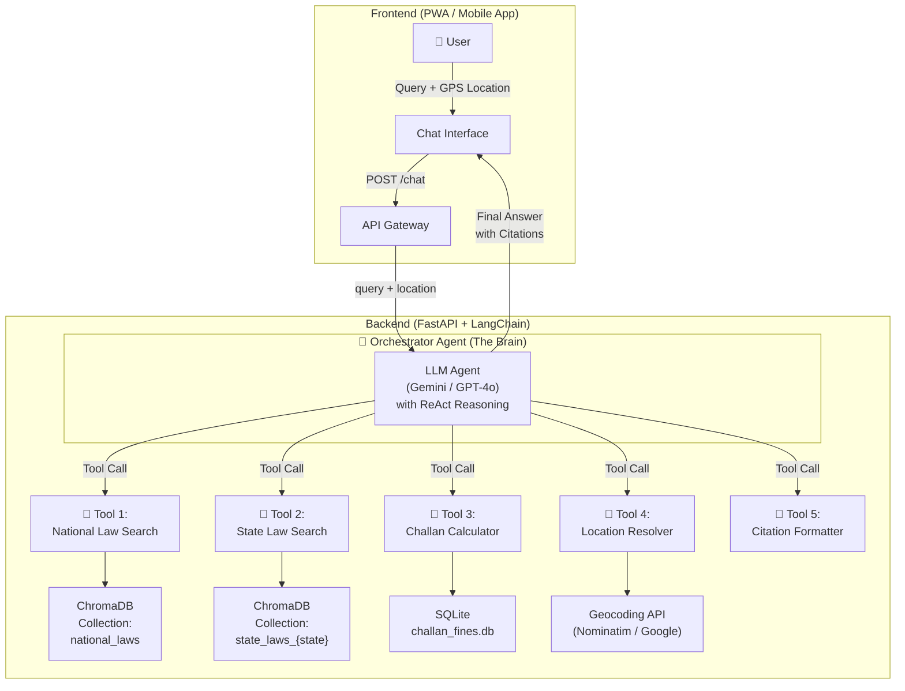
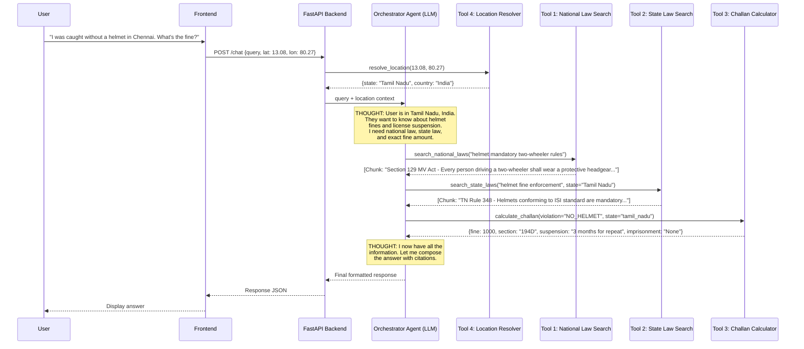

# DriveLegal: Agentic RAG — Full Architecture Deep-Dive

---

## Part 1: Your Understanding of RAG — Validated & Corrected

Your understanding is fundamentally correct. Here is your flow mapped against the technical terms, with corrections noted:

```
YOUR UNDERSTANDING                         TECHNICAL TERM
─────────────────────────────────────────────────────────────
1. Gather documents (PDFs)              →  Data Collection ✅
2. Ingest                               →  Document Ingestion ✅
3. EDA, cleaning, transformation        →  Data Preprocessing ✅
4. Tokenize / chunk to smaller ones     →  Chunking ✅
5. Vectorize tokens, store in Vector DB →  Embedding + Indexing ✅
6. User prompt → same process up to     →  Query Embedding ✅
   vectorization
7. Backend validates user vectors with  →  Similarity Search ✅
   stored vectors, finds closest          (Cosine / Dot Product)
8. Retrieved chunks sent to LLM        →  Context Augmentation ✅
9. LLM assembles and gives output      →  Generation ✅
```

> [!NOTE]
> **One important correction:** In step 8, the LLM does not "compare the probability each chunk has" in the way you described. What actually happens is:
> - The **Vector DB** already ranked the chunks by similarity score.
> - The top-K chunks (e.g., top 5) are **concatenated into the LLM's prompt** as context.
> - The LLM then generates a **natural language answer** grounded in that context.
> - The LLM doesn't re-rank the chunks; it reads them like a human reading reference material and writes an answer.

### Standard RAG Flow (What You Described)


**The problem with Standard RAG for DriveLegal:**
- It treats ALL laws as one flat pool. A query about "helmet fine" might retrieve chunks from 5 different states randomly.
- It cannot **reason** about which laws apply. It just fetches "similar text."
- It cannot call external tools like a Challan Calculator database.
- It has no ability to **plan** multi-step queries (e.g., "First check national law, THEN check state override").

This is where **Agentic RAG** comes in.

---

## Part 2: What is Agentic RAG?

In standard RAG, the flow is linear: `Query → Search → Retrieve → Generate`. The LLM is passive — it only generates text from whatever context it receives.

In **Agentic RAG**, the LLM becomes an **autonomous decision-maker (an Agent)**. It can:
1. **Think** about what information it needs.
2. **Plan** a sequence of actions.
3. **Use Tools** (search databases, call APIs, run calculations).
4. **Observe** the results of its actions.
5. **Iterate** — if the first search wasn't enough, it searches again with a refined query.
6. **Synthesize** a final answer from all gathered evidence.

This follows the **ReAct (Reasoning + Acting)** paradigm:

```
THOUGHT  →  I need to find the national helmet law first.
ACTION   →  Call tool: search_national_laws("helmet mandatory")
OBSERVE  →  Got results: Section 129 of MV Act 2019...
THOUGHT  →  Now I need to check if Tamil Nadu has any state-specific override.
ACTION   →  Call tool: search_state_laws("helmet", state="Tamil Nadu")
OBSERVE  →  Got results: TN Rule 348...
THOUGHT  →  The user also asked about the fine. Let me check the challan DB.
ACTION   →  Call tool: query_challan_db(violation="no_helmet", state="TN")
OBSERVE  →  Got results: Fine = ₹1000, Section = 194D
THOUGHT  →  I now have all the information. Let me compose the final answer.
ACTION   →  Generate final response with citations.
```

---

## Part 3: The DriveLegal Agent Architecture

For DriveLegal, we need **one Orchestrator Agent** that coordinates **multiple specialized Tools** (not separate agents, but callable functions). This is the most practical and hackathon-friendly design.

### System Architecture Diagram



---

## Part 4: Detailed Breakdown of Each Component

### 4.1 The Orchestrator Agent (The Brain)

This is the **single central LLM** that receives the user's query and decides what to do. It does NOT answer from its own training data. Instead, it **plans and executes** a sequence of tool calls.

| Property | Detail |
|---|---|
| **LLM Model** | Gemini 2.0 Flash / GPT-4o-mini / Llama 3.1 70B |
| **Framework** | LangChain `create_tool_calling_agent` or LlamaIndex `ReActAgent` |
| **System Prompt** | A strict legal persona prompt (see below) |
| **Available Tools** | 5 tools (described in 4.2 – 4.6) |
| **Memory** | Short-term chat history (last 5 messages) for follow-up questions |

**System Prompt (Critical for Legal Accuracy):**
```
You are DriveLegal, an AI legal assistant specializing in traffic laws.

RULES:
1. NEVER answer from your own knowledge. ONLY use information
   returned by your tools.
2. When answering about a law, ALWAYS call BOTH the national law
   search AND the relevant state law search.
3. If a state law contradicts or overrides a national law, clearly
   state: "The national law says X, but [State] has overridden
   this with Y."
4. For fine/penalty questions, ALWAYS use the Challan Calculator
   tool for exact amounts. Never estimate.
5. ALWAYS cite the exact Section number and Act name.
6. If information is not found in any tool, say: "I don't have
   verified information about this. Please consult a legal
   professional."
7. The user's current location is: {user_location}
```

### 4.2 Tool 1: National Law Search

Searches the Vector DB collection containing **only national-level** legal documents.

| Property | Detail |
|---|---|
| **Tool Name** | `search_national_laws` |
| **Input** | `query: str` (the search query, e.g., "helmet rules for two-wheelers") |
| **What it does** | Embeds the query, runs a similarity search against the `national_laws` ChromaDB collection |
| **Data Sources** | `Motor Vehicles Act 1988`, `MV Amendment Act 2019`, `Central Motor Vehicle Rules 1989` |
| **Output** | Top 5 relevant text chunks with metadata (section number, year, page) |

**How the data gets in (Ingestion):**
```
motorvehicleact-1988.pdf ──┐
MV Amendment Act 2019.pdf ─┤──→ PDF Parser ──→ Chunker (500 words) ──→ Embedder ──→ ChromaDB
Central MV Rules 1989.pdf ─┘                   + metadata:                          Collection:
                                                {"level": "national",               "national_laws"
                                                 "act": "MV Act 1988",
                                                 "year": 1988}
```

### 4.3 Tool 2: State Law Search

Searches the Vector DB collection containing **state-specific** legal documents. The agent passes the user's state as a parameter.

| Property | Detail |
|---|---|
| **Tool Name** | `search_state_laws` |
| **Input** | `query: str`, `state: str` (e.g., "Tamil Nadu") |
| **What it does** | Embeds the query, runs similarity search against the state-specific collection, filtered by `state` metadata |
| **Data Sources** | `TN Motor Vehicles Rules 1989`, `TN MV Taxation Act 1974`, `TN MV Taxation Rules 1974` (and future state PDFs) |
| **Output** | Top 5 relevant text chunks with metadata |

**Why separate from National?** Because the Agent can **choose** to call this tool or not. If the user asks "What is the national speed limit?", the agent might decide it only needs Tool 1. If the user asks "What is the fine for speeding in Chennai?", the agent calls BOTH Tool 1 and Tool 2 for TN.

### 4.4 Tool 3: Challan Calculator

This is NOT a vector search. This is a **structured database query** for exact fine amounts.

| Property | Detail |
|---|---|
| **Tool Name** | `calculate_challan` |
| **Input** | `violation: str`, `vehicle_type: str` (optional), `state: str` (optional) |
| **What it does** | Queries an SQLite database with exact fine amounts |
| **Data Source** | Manually curated `challan_fines.db` (extracted from the 2019 Amendment's fine schedule) |
| **Output** | Exact fine amount, applicable section, imprisonment (if any), compounding fee |

**Example SQLite Schema:**
```sql
CREATE TABLE challan_fines (
    id INTEGER PRIMARY KEY,
    violation_code TEXT NOT NULL,       -- e.g., "NO_HELMET"
    violation_description TEXT,          -- "Riding without helmet"
    applicable_section TEXT,             -- "Section 194D"
    act_name TEXT,                       -- "MV Amendment Act 2019"
    vehicle_type TEXT,                   -- "2-wheeler" / "4-wheeler" / "all"
    jurisdiction TEXT DEFAULT 'national',-- "national" / "tamil_nadu" / etc.
    first_offence_fine INTEGER,          -- 1000
    repeat_offence_fine INTEGER,         -- 2000
    imprisonment TEXT,                   -- "None" / "Up to 3 months"
    compounding_fee INTEGER,             -- 500
    license_suspension TEXT,             -- "3 months" / "None"
    notes TEXT                           -- Any special conditions
);
```

> [!IMPORTANT]
> **Why a separate SQL database instead of RAG for fines?** Because RAG retrieves *text* and the LLM *interprets* it — which can lead to hallucinated numbers. A SQL query returns the *exact* number every time. This is critical for the "Challan Calculator Functionality & Correctness" evaluation criteria.

### 4.5 Tool 4: Location Resolver

Converts the user's GPS coordinates into a usable state/country name.

| Property | Detail |
|---|---|
| **Tool Name** | `resolve_location` |
| **Input** | `latitude: float`, `longitude: float` |
| **What it does** | Calls a Reverse Geocoding API to get `state`, `country` |
| **API** | OpenStreetMap Nominatim (free) or Google Maps Geocoding API |
| **Output** | `{"state": "Tamil Nadu", "country": "India", "city": "Chennai"}` |

This is called **once** at the start of the conversation (or when the user's location changes) and the result is injected into the Agent's system prompt.

### 4.6 Tool 5: Citation Formatter

Ensures every response includes proper legal citations.

| Property | Detail |
|---|---|
| **Tool Name** | `format_citation` |
| **Input** | `section: str`, `act_name: str`, `year: int` |
| **What it does** | Formats a standardized legal citation string |
| **Output** | `"Section 194D, Motor Vehicles (Amendment) Act, 2019"` |

This is a simple utility tool, but it forces the agent to always produce consistent citations.

---

## Part 5: Full Request Lifecycle (End-to-End Example)

**User asks:** *"I was caught without a helmet in Chennai. What's the fine and can my license be suspended?"*



**Final Output to User:**
> **Helmet Violation in Chennai, Tamil Nadu**
>
> Yes, wearing a helmet is mandatory under **Section 129 of the Motor Vehicles Act, 1988** (as amended in 2019). Tamil Nadu enforces this under **TN Motor Vehicle Rule 348**, which requires ISI-standard helmets.
>
> **Fine Details:**
> | | Amount |
> |---|---|
> | First Offence | ₹1,000 |
> | Repeat Offence | ₹2,000 |
> | License Suspension | 3 months (repeat offence) |
> | Imprisonment | None |
>
> *Source: Section 194D, Motor Vehicles (Amendment) Act, 2019*

---

## Part 6: Full Tech Stack

| Layer | Technology | Why |
|---|---|---|
| **LLM (Agent Brain)** | Gemini 2.0 Flash API / GPT-4o-mini | Fast, cheap, supports tool-calling natively |
| **Agent Framework** | LangChain (`create_tool_calling_agent`) or LlamaIndex (`ReActAgent`) | Handles the ReAct loop, tool routing, memory |
| **Embedding Model** | `text-embedding-3-small` (OpenAI) or `BAAI/bge-m3` (local/free) | Converts text chunks and queries into vectors |
| **Vector Database** | ChromaDB (local, free) or Pinecone (cloud) | Stores and searches embedded document chunks |
| **Structured Database** | SQLite | Stores exact challan fine amounts |
| **PDF Parser** | LlamaParse / PyMuPDF / Unstructured | Extracts text and tables from your legal PDFs |
| **Backend API** | Python + FastAPI | Serves the agent as an API endpoint |
| **Frontend** | Next.js (PWA) or React Native | Chat UI with geolocation and offline support |
| **Geocoding** | OpenStreetMap Nominatim API (free) | Converts GPS coordinates to state/country |
| **Offline Challan** | SQLite bundled in the frontend (via sql.js for web) | Challan Calculator works without internet |

### Key Python Libraries
```
langchain>=0.2
langchain-google-genai  # or langchain-openai
chromadb
fastapi
uvicorn
sqlalchemy
pymupdf  # or llama-parse
sentence-transformers  # if using local embeddings
```

---

## Part 7: Concepts You Should Know

| Concept | What It Means | Where It's Used |
|---|---|---|
| **RAG** | Retrieval-Augmented Generation — fetch relevant docs before generating | Core of the chatbot |
| **ReAct** | Reasoning + Acting — LLM thinks step-by-step and calls tools | The Agent's decision loop |
| **Tool Calling** | LLM outputs a structured function call instead of text | How the agent uses Tools 1-5 |
| **Embedding** | Converting text into a numerical vector (array of floats) | Storing and searching documents |
| **Cosine Similarity** | Mathematical measure of how "close" two vectors are | Finding relevant chunks in Vector DB |
| **Chunking** | Splitting large documents into smaller pieces (300-500 words) | Preparing PDFs for the Vector DB |
| **Metadata Filtering** | Adding tags to chunks and filtering search results by those tags | Separating national vs. state laws |
| **System Prompt** | Instructions given to the LLM that define its behavior | Controlling legal accuracy |
| **Few-Shot Prompting** | Giving the LLM example Q&A pairs in the prompt | Improving answer format consistency |
| **Hallucination** | LLM generates false information confidently | The #1 risk in legal AI |
| **Grounding** | Forcing the LLM to only use retrieved context, not its training data | Preventing hallucination |
| **PWA** | Progressive Web App — a website that behaves like a mobile app | Offline capability |

---

## Part 8: Why This Approach Wins

| Evaluation Criteria | How Agentic RAG Addresses It |
|---|---|
| **Legal accuracy & regulatory coverage** | Separate National + State tools ensure layered legal reasoning. Strict system prompt prevents hallucination. Citations are mandatory. |
| **Challan calculator functionality & correctness** | SQL database guarantees exact numbers. No LLM interpretation of fine amounts. |
| **Information integration across countries** | Adding a new country = adding a new Tool + Vector DB collection. The Agent automatically adapts. |
| **User interface and accessibility** | Clean chat UI + dedicated Challan Calculator tab. Multilingual voice support possible. |
| **Offline functionality** | SQLite challan DB bundled locally. Decision-tree fallback when no internet. |
